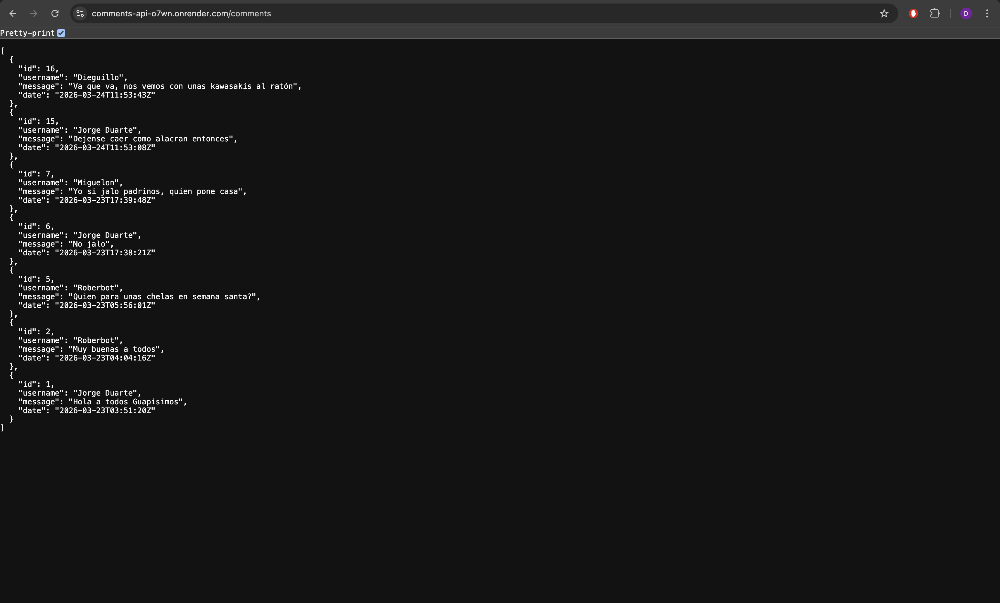

# Comment Wall App - Backend

RESTful API contruida con [Go](https://go.dev/), encargada de manejar peticiones HTTP para obtener o eliminar comentarios.

## Tecnologías Utilizadas

- **Lenguaje:** Go
- **Despliegue:** Render
- **Base de datos:** Railway (mysql)

## Requisitos Previos

Para poder ejecutar el proyecto en tu entorno local, asegúrate de tener instalado:

- [Go](https://go.dev/dl/) (1.26.0+)

## Clona el repositorio:

```Bash
git clone https://github.com/Naraka28/comments-api.git
cd comments-api
```

## Ejecucion de la Aplicacion

Para levantar la API debemos utilizar el siguiente comando, el servidor se levantara en http://localhost:3000

```Bash
go run main.go
```

## Enlace del proyecto

Enlace donde esta hosteado el backend: [Comment Wall App - Back](https://comments-api-o7wn.onrender.com/comments)

## Vista Previa


